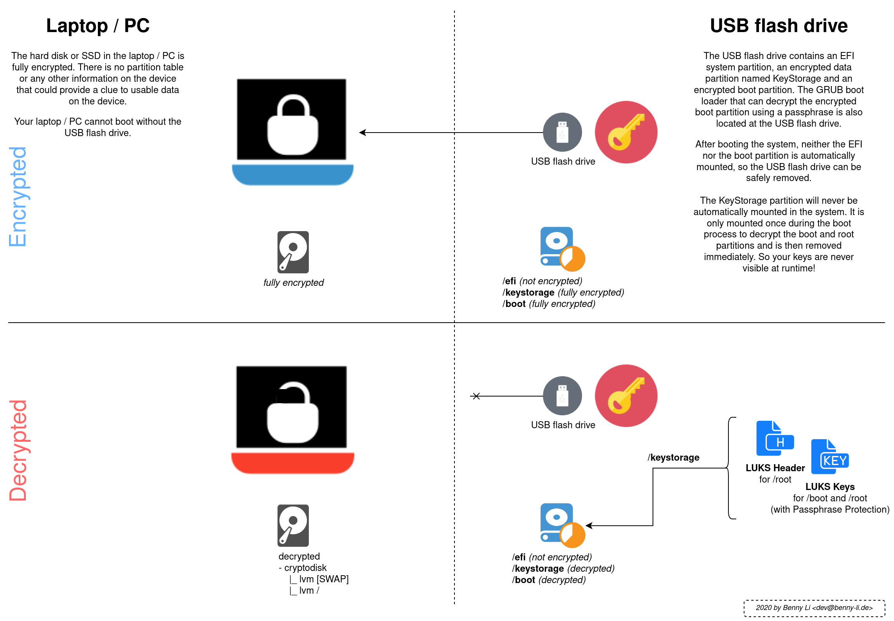

# Arch Linux install scripts

This is a personal collection of shell scripts to install Arch Linux with full disk encryption.

## Overview



## Requirements

You will need at least:

- One USB flash drive (_better two for a backup_)
- A good passphrase
- Another USB flash drive with a bootable Arch Linux Install ISO image on it

## Usage

1. Boot into the Arch Linux installation medium.

2. Plug-in your USB flash drive which should act as your KeyStorage.

3. Check which devices are your main drive and your KeyStorage USB flash drive

   ```bash
   root@archiso ~ # lsblk 
   NAME    MAJ:MIN RM    SIZE RO TYPE  MOUNTPOINT
   loop0     7:0    0  545.2M  1 loop  /run/archiso/sfs/airootfs
   sda       8:0    0  953,9G  0 disk  
   sdb       8:16   0      8G  0 disk  
   sr0      11:0    1    622M  0 rom   /run/archiso/bootmnt
   ```

   In this example `sda` would be our main drive and `sdb` the USB flash drive.
   Remember these as your will be asked for it later.

4. Connect to the internet if you do not put these scripts onto your bootable USB flash drive.

5. Get the [init.sh](https://github.com/BennyLi/arch-linux-install-scripts/blob/master/init.sh) script via https://git.io/JvEbY and execute it. Here is the oneliner:

   ```bash
   curl -L https://git.io/JvEbY > init.sh && chmod +x init.sh && ./init.sh
   ```

6. Follow the on-screen instructions.

## Advanced usage

If you like to set the variables by hand and skip most of the dialogs checkout [00_setup-variables.sh](https://github.com/BennyLi/arch-linux-install-scripts/blob/master/00_setup-variables.sh) file.

# Buy me a cup of tea 🍵

If you like my work feel free to bring some love back. 

- Give this repo a ⭐
- Follow me on [GitHub](https://github.com/BennyLi) or [Twitter](https://twitter.com/BennyLindemann)
- Drop some 💰 via [PayPal](https://www.paypal.com/cgi-bin/webscr?cmd=_s-xclick&hosted_button_id=L5FWZYAM5Y5A4&source=url)
